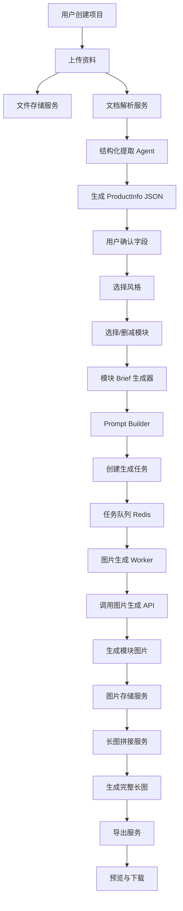
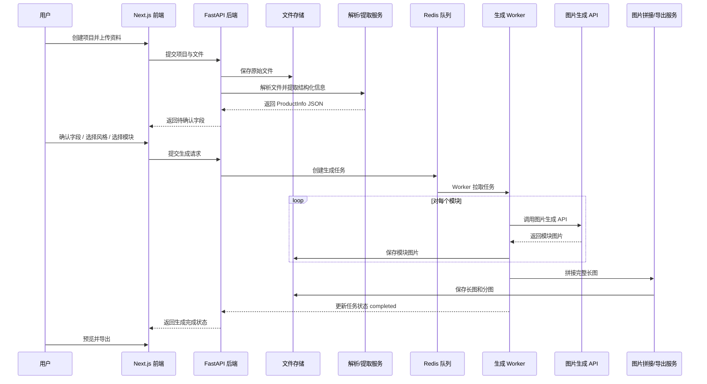

# 商品详情图生成智能体 PRD

> 版本：V1 / MVP  
> 状态：已完成产品路线图、MVP 原型选型、架构设计蓝图  
> 适用对象：产品、设计、工程、AI 工作流搭建  
> 备注：本 PRD 中包含 5 张 UI 参考图，后续生成 UI/UX 时必须参考。

---

# 1. 核心目标（Mission）

打造一个面向护肤美妆类商品的内部智能体，让业务运营只需上传产品资料、选择品类和风格，即可自动生成一整套**结构正确、风格统一、视觉达到 80 分的店铺主图、活动主图和商品详情页图片**。

第一版目标不是完全替代设计师，而是先实现：

> **一键生成 80 分初稿，人工少量修改后可用于内部验证，逐步优化到可直接上线。**

---

# 2. 用户画像（Persona）

## 2.1 目标用户

公司内部的**业务运营人员**。

## 2.2 用户现状

当前商品详情页制作主要依赖人工手搓，存在以下问题：

- 设计产能不够
- 出图速度慢
- 图片质量不稳定
- 详情页结构不统一
- 视觉不够高级
- 不同人做出来的质量差异大

## 2.3 核心痛点

按优先级排序：

1. **结构正确**
2. **风格统一**
3. **视觉高级**
4. **减少人工工作量**
5. **提升出图速度**

## 2.4 使用场景

业务运营为一个护肤美妆商品制作电商图片时：

1. 上传产品资料
2. 选择商品品类和视觉风格
3. 确认 AI 提炼出的产品信息
4. 选择需要生成的版块（主图 / 活动主图 / 详情图）
5. 主图：自动生成 5 张电商主图（白底图、首图、成分、效果、使用场景）
6. 活动主图：在主图基础上叠加促销元素，生成 5 张活动主图
7. 详情图：默认使用 7 个模块，自动生成完整详情长图
8. 导出分图和长图

---

# 3. V1：最小可行产品（MVP）

MVP 的核心链路：

> **上传资料 → 选择品类/风格 → AI 结构化提取 → 人工确认 → 选择版块/勾选模块 → 生成主图 + 活动主图 + 详情图 → 预览 → 导出**

## 3.1 P0 功能清单（按优先级排序）

### P0-1 项目创建
- 创建一个新的商品详情图项目
- 输入商品名称、品类、风格
- 上传产品资料与产品图

### P0-2 资料上传
支持上传：
- 产品图
- Word
- PDF
- Excel
- 检测报告
- 成分表
- 使用说明
- 资质材料
- 其他辅助图片

### P0-3 AI 结构化提取
需要提取的核心字段：
- 产品名称
- 产品品类
- 核心卖点
- 核心功效
- 核心成分
- 目标人群
- 使用方法
- 权威资质
- 实验/检测信息
- 效果对比数据
- 适合生成哪些模块

### P0-4 人工确认
每个字段支持：
- 单独确认
- 单独修改
- 单独删除
- 全部确认

### P0-5 三大生成版块

系统支持三个独立的图片生成版块，运营可按需切换生成：

#### P0-5a 店铺主图（5 张）
用于电商平台商品货架展示，默认生成以下 5 张，可删减：
1. **白底图**：纯白背景 + 产品居中，用于平台主图审核
2. **首图**：产品大图 + 一句话核心卖点，主视觉图
3. **次图-成分**：核心成分 + 原料质感，突出配方优势
4. **次图-效果**：核心功效 + 使用收益，突出效果可信度
5. **次图-使用场景**：目标人群 + 生活场景，增强代入感

#### P0-5b 活动主图（5 张）
在店铺主图的结构基础上叠加促销元素（角标、优惠券、限时标签等），默认生成以下 5 张，可删减：
1. **活动白底图**：白底商品 + 促销角标
2. **活动首图**：产品图 + 核心卖点 + 促销利益点
3. **活动次图-成分**：核心成分 + 活动氛围
4. **活动次图-效果**：核心功效 + 促销转化
5. **活动次图-使用场景**：使用场景 + 活动元素

活动主图支持运营填写具体促销方式（如「618 限时 8 折」「买一送一」），生成时会参考。若不填写，AI 只使用泛化活动氛围，不编造具体折扣或价格。

#### P0-5c 详情图（7 张）
用于商品详情页，按固定结构生成完整长图，默认使用以下 7 个模块，可删减，不可自定义新增：
1. 详情首图
2. 权威资质展示
3. 痛点场景
4. 效果对比
5. 竞品对比
6. 成分页
7. 使用方法

### P0-6 模块删减
- 三个版块各自独立管理模块的启用/禁用
- 允许业务勾选删减
- 不支持新增自定义模块

### P0-7 风格选择
第一版提供 3 套固定风格：
- 绿色修护风
- 蓝色补水风
- 金色抗老风

风格对三个版块统一生效，确保主图、活动主图和详情图视觉一致。

### P0-8 图片生成
- 主图：生成 5 张独立主图（1:1 电商货架构图）
- 活动主图：生成 5 张带促销元素的独立主图
- 详情图：生成 7 张模块分图，支持拼接完整长图
- 同一套图风格必须统一
- 三个版块可独立生成，互不影响

### P0-9 预览
- 主图 / 活动主图：按卡片网格展示 5 张独立图片，每张支持单独下载和重新生成
- 详情图：左侧展示完整长图，右侧展示模块目录，点击目录可快速定位模块
- 顶部版块切换 Tab，可在主图、活动主图、详情图之间切换查看

### P0-10 导出
第一版支持导出：
- 主图：5 张独立主图 PNG
- 活动主图：5 张独立活动主图 PNG
- 详情图：7 张分图 PNG/JPG + 1 张完整长图 JPG

---

# 4. V1.1 功能增强（Feature Enhancements）

> V1.1 目标：在 MVP 核心链路跑通的基础上，提升运营日常使用体验和出图质量。
> 详细方案见：`docs/功能增强建议.md`

## V1.1-1 单张图片微调指令（⭐⭐⭐）
- 预览页每张图下方加微调输入框
- 运营用自然语言描述修改意见（「文字放大 30%」「背景改深绿」「产品往左移」）
- 后端将原图 + 微调指令发给图片模型做局部编辑
- 核心价值：解决「80 分初稿 → 90 分可用」的最后一步

## V1.1-2 多版本 A/B 生成 + 对比（⭐⭐⭐）
- 每个模块最多保留 3 个历史版本
- 重新生成时旧图不覆盖，push 到版本列表
- 预览页版本切换器，运营可在版本间对比选择
- 导出长图时使用选中的版本

## V1.1-3 品牌色提取 + 智能风格推荐（⭐⭐）
- 上传产品主图后自动提取包装主色调（前 3 色）
- 计算与 3 套风格主色的色差，推荐最匹配的风格
- 风格卡片显示「✨ 根据产品配色推荐」标签

## V1.1-4 多平台尺寸适配（⭐）
- 生成前选择目标平台（淘宝/天猫、京东、抖音、拼多多、小红书）
- 自动调整图片尺寸参数
- 导出时可同时输出多平台尺寸包

## V1.1-5 项目模板（⭐⭐）
- 生成满意后可「保存为模板」（模块列表 + 顺序 + 风格 + 品类）
- 新建项目时「从模板创建」一键导入配置
- 内置 2-3 个官方推荐模板

## V1.1-6 生成图片 AI 质量自检（⭐⭐）
- 每张图生成后自动调用文字模型做质量检查
- 检查维度：乱码文字、产品变形、文字可读性、构图合理性
- 不合格自动标记「⚠️ 建议重新生成」并附原因

## V1.1-7 文案话术优化建议（⭐）
- AI 解析后在确认页额外给出文案优化建议卡片
- 包括卖点精练度、排序建议、目标人群话术调整
- 运营可一键采纳或忽略

## V1.1-8 一键复制项目（⭐）
- 项目顶部加「复制项目」按钮
- 复制所有风格、模块、品类配置，清空产品信息和已生成图片
- 运营只需替换产品资料即可

---

# 5. V2 及以后版本（Future Releases）

## V2
- 在线编辑图片文字
- 替换产品图
- 替换单模块图片
- 调整模块顺序
- 可编辑源文件导出（Figma / PSD / Canva / JSON）
- 更强的资料解析能力
- 品牌视觉规范库
- 合规检查

## V3
- 竞品图上传拆解
- 自动提取竞品结构与视觉表达
- 多品类扩展：洗护、彩妆、个护、保健品、宠物、家居等

---

# 6. 关键业务逻辑（Business Rules）

## 6.1 默认 17 模块（三大版块）
系统包含 3 个生成版块共 17 个模块（主图 5 + 活动主图 5 + 详情图 7），各版块内允许删减，不允许新增自定义模块。

## 6.2 大纲必须按既定结构生成
AI 不允许自行新增一级模块，模块职责固定。

## 6.3 生成前必须确认 AI 提炼信息
用户必须在生成前完成字段确认。

## 6.4 资料缺失时，AI 自动补全
V1 是内部实验工具，资料上传不是强制项。

当用户没有上传某类资料时，AI 自动补全对应内容，确保完整生成：
- 没有实验报告 → 生成实验室/报告感页面
- 没有专利 → 生成专研配方/研发理念页面
- 没有 before/after 图 → 生成对比示意图
- 没有数据 → 生成示意型百分比数据
- 没有竞品资料 → 生成普通产品 vs 本产品对比
- 没有成分详情 → 根据品类和功效补全合理成分方案
- 没有使用方法 → 生成标准使用步骤

## 6.5 风格必须全套统一
同一个项目中的所有模块必须统一：
- 主色
- 字体
- 标题层级
- 图标风格
- 产品图风格
- 背景氛围
- 模块间视觉连续性

## 6.6 V1 不做在线编辑
第一版只支持信息确认、模块删减、风格选择、生成、预览、导出。

## 6.7 生成时间不设强约束
系统需要支持：
- 长超时
- 任务状态轮询
- 失败后重试
- 单模块失败不丢项目

---

# 7. 数据契约（Data Contract）

## 7.1 Project
```json
{
  "id": "project_001",
  "name": "CICA 修护精华详情页",
  "product_category": "护肤精华",
  "style_id": "green_repair",
  "status": "draft",
  "created_at": "2026-04-29T12:00:00Z",
  "updated_at": "2026-04-29T12:00:00Z"
}
```

## 7.2 UploadedFile
```json
{
  "id": "file_001",
  "project_id": "project_001",
  "file_name": "产品说明书.pdf",
  "file_type": "pdf",
  "file_url": "https://storage.example.com/files/product.pdf",
  "purpose": "product_info",
  "parsed_text": "产品名称：CICA 修护精华...",
  "created_at": "2026-04-29T12:00:00Z"
}
```

## 7.3 ProductInfo
```json
{
  "project_id": "project_001",
  "product_name": "CICA 修护精华",
  "category": "护肤精华",
  "spec": "30ml",
  "core_selling_points": ["舒缓泛红不适", "补水锁水", "强韧肌肤屏障"],
  "functions": ["舒缓", "补水", "修护屏障"],
  "ingredients": [
    {"name": "积雪草", "benefit": "帮助舒缓泛红与脆弱不适"},
    {"name": "神经酰胺", "benefit": "帮助强韧肌肤屏障"},
    {"name": "透明质酸", "benefit": "补充水分，帮助锁水维稳"}
  ],
  "target_users": ["换季泛红人群", "干燥紧绷人群", "屏障脆弱人群"],
  "usage_method": ["洁面后使用", "取 2-3 滴于掌心", "均匀涂抹全脸", "轻拍至吸收"],
  "authority_assets": ["实验室研发", "实验报告", "专利理念"],
  "effect_claims": [
    {"claim": "肌肤更水润", "value": "92%", "source_type": "ai_generated"},
    {"claim": "泛红不适有所缓解", "value": "88%", "source_type": "ai_generated"}
  ],
  "confirmation_status": "confirmed"
}
```

## 7.4 ModuleConfig
```json
{
  "project_id": "project_001",
  "modules": [
    {"id": "main_white_bg", "name": "白底图", "description": "纯白背景 + 产品居中", "enabled": true, "order": 1, "image_group": "main"},
    {"id": "main_hero_selling_point", "name": "首图", "description": "产品图 + 一句话核心卖点", "enabled": true, "order": 2, "image_group": "main"},
    {"id": "main_ingredient", "name": "次图-成分", "description": "核心成分 + 原料质感", "enabled": true, "order": 3, "image_group": "main"},
    {"id": "main_effect", "name": "次图-效果", "description": "核心功效 + 使用收益", "enabled": true, "order": 4, "image_group": "main"},
    {"id": "main_usage_scene", "name": "次图-使用场景", "description": "目标人群 + 生活场景", "enabled": true, "order": 5, "image_group": "main"},
    {"id": "campaign_white_bg", "name": "活动白底图", "description": "白底商品 + 促销角标", "enabled": true, "order": 1, "image_group": "campaign"},
    {"id": "campaign_hero_selling_point", "name": "活动首图", "description": "产品图 + 核心卖点 + 促销利益点", "enabled": true, "order": 2, "image_group": "campaign"},
    {"id": "campaign_ingredient", "name": "活动次图-成分", "description": "核心成分 + 活动氛围", "enabled": true, "order": 3, "image_group": "campaign"},
    {"id": "campaign_effect", "name": "活动次图-效果", "description": "核心功效 + 促销转化", "enabled": true, "order": 4, "image_group": "campaign"},
    {"id": "campaign_usage_scene", "name": "活动次图-使用场景", "description": "使用场景 + 活动元素", "enabled": true, "order": 5, "image_group": "campaign"},
    {"id": "hero", "name": "详情首图", "description": "产品大图 + 核心卖点", "enabled": true, "order": 1, "image_group": "detail"},
    {"id": "authority", "name": "权威资质展示", "description": "实验室 / 科学家 / 报告 / 专利", "enabled": true, "order": 2, "image_group": "detail"},
    {"id": "pain_scene", "name": "痛点场景", "description": "皮肤问题 + 尝试无效", "enabled": true, "order": 3, "image_group": "detail"},
    {"id": "effect_comparison", "name": "效果对比", "description": "使用前后 + 百分比数据", "enabled": true, "order": 4, "image_group": "detail"},
    {"id": "competitor_comparison", "name": "竞品对比", "description": "质地 / 成分 / 效果 / 负面体验", "enabled": true, "order": 5, "image_group": "detail"},
    {"id": "ingredient", "name": "成分页", "description": "特殊成分 + 对应解决问题", "enabled": true, "order": 6, "image_group": "detail"},
    {"id": "usage", "name": "使用方法", "description": "商品怎么用", "enabled": true, "order": 7, "image_group": "detail"}
  ]
}
```

## 7.5 StyleConfig
```json
{
  "id": "green_repair",
  "name": "绿色修护风",
  "primary_color": "#8DBF9A",
  "secondary_color": "#F4FAF6",
  "accent_color": "#2F6B4F",
  "visual_keywords": ["植物", "水滴", "温和", "修护", "实验室轻科技"],
  "font_style": "clean_premium",
  "icon_style": "thin_line"
}
```

## 7.6 GeneratedImage
```json
{
  "id": "img_001",
  "project_id": "project_001",
  "module_id": "hero",
  "module_name": "首图",
  "image_url": "https://storage.example.com/images/hero.png",
  "status": "completed",
  "prompt": "生成首图：产品大图 + 核心卖点...",
  "source_type": "ai_generated",
  "created_at": "2026-04-29T12:00:00Z"
}
```

## 7.7 ExportResult
```json
{
  "project_id": "project_001",
  "long_image_url": "https://storage.example.com/export/full_detail.png",
  "split_images": [
    {"module_id": "hero", "url": "https://storage.example.com/export/01_hero.png"},
    {"module_id": "authority", "url": "https://storage.example.com/export/02_authority.png"}
  ],
  "export_format": "png",
  "created_at": "2026-04-29T12:00:00Z"
}
```

---

# 8. MVP 原型图（已选方案 A：向导式流程）

## 8.1 设计理念

采用**向导式流程**，按步骤引导业务完成：

1. 上传资料
2. 选择品类和风格
3. 确认 AI 提炼结果
4. 选择生成模块
5. 预览和导出

这样做的原因：
- 对业务运营最友好
- 能降低误操作
- 能清晰暴露 AI 提炼信息
- 能保证 7 模块结构不跑偏
- 适合第一版快速上线

## 8.2 UI/UX 参考要求

后续在生成 UI/UX 或继续细化高保真设计时，**必须参考以下 5 张页面图**。它们不是最终 UI 规范，但应作为第一版视觉与信息架构参考基线。

### 页面 1：上传资料页


参考重点：
- 顶部 Stepper 结构
- 左侧大上传区
- 右侧当前项目信息摘要
- 主按钮位于右下

### 页面 2：选择品类和风格页


参考重点：
- 品类选择 + 风格卡片式选择
- 3 套风格并排展示
- 被选中的风格有明显状态反馈

### 页面 3：确认 AI 提炼结果页


参考重点：
- 字段级确认/修改
- 支持“全部确认”操作
- 关键字段以列表卡片呈现

### 页面 4：选择生成模块页


参考重点：
- 默认 7 模块结构清晰列出
- 可删减但不新增
- 生成按钮突出

### 页面 5：结果预览与导出页


参考重点：
- 左侧完整长图预览
- 右侧模块目录
- 导出完整长图 / 导出分图双按钮
- 清晰的生成完成状态

---

# 9. 架构设计蓝图（Architecture Blueprint）

## 9.1 技术选型

### 前端
- **Next.js 15 + TypeScript**
- **Tailwind CSS**
- **shadcn/ui**

选择理由：
- 上手快，适合单人 + AI 协作开发
- 页面路由、SSR/CSR 混合能力成熟
- 做后台系统效率高
- 组件生态成熟，便于快速落地

### 后端 / AI 编排
- **FastAPI（Python）**

选择理由：
- 文档解析、LLM 编排、图像处理生态更适合 Python
- 调用 OCR、PDF、Word、Excel 解析库更方便
- 后续扩展 AI agent / workflow 更自然

### 异步任务
- **Redis + RQ（或 Celery）**

选择理由：
- 图片生成和长图拼接都属于长耗时任务
- 需要可靠的后台任务队列与状态追踪

### 数据库
- **PostgreSQL**

选择理由：
- 结构化数据清晰
- 适合保存项目、文件、模块、任务状态、导出结果

### 文件存储
- **S3 兼容对象存储（如 OSS / R2 / MinIO）**

选择理由：
- 适合文件、图片、导出物统一存储
- 可扩展，方便后续上线

### 图像处理
- **Pillow（Python）**

选择理由：
- 足够满足长图拼接、分图输出、压缩导出等需求
- 简单直接，适合 MVP

### 文档解析
- PDF：PyMuPDF
- Word：python-docx
- Excel：openpyxl / pandas
- OCR：可插拔 OCR 服务

---

## 9.2 核心流程图（Flowchart）



---

## 9.3 关键业务流（Sequence Diagram）



---

## 9.4 组件交互说明

由于当前没有现有代码库，本次开发视为**绿地项目**，不存在旧模块兼容问题。建议按以下模块划分代码。

### 前端建议结构

```text
frontend/
  app/
    page.tsx
    projects/new/page.tsx
    projects/[id]/upload/page.tsx
    projects/[id]/style/page.tsx
    projects/[id]/review/page.tsx
    projects/[id]/modules/page.tsx
    projects/[id]/preview/page.tsx
  components/
    stepper.tsx
    upload-dropzone.tsx
    project-summary-card.tsx
    category-selector.tsx
    style-card.tsx
    extracted-field-row.tsx
    module-selector.tsx
    long-image-preview.tsx
    module-directory.tsx
    export-actions.tsx
    generation-status.tsx
  lib/
    api-client.ts
    types.ts
    constants.ts
```

### 后端建议结构

```text
backend/
  app/
    main.py
    api/
      projects.py
      uploads.py
      extraction.py
      generation.py
      exports.py
      tasks.py
    schemas/
      project.py
      file.py
      product_info.py
      module.py
      generation.py
    services/
      file_parser.py
      ocr_service.py
      llm_structurer.py
      style_service.py
      module_planner.py
      brief_builder.py
      prompt_builder.py
      image_generator.py
      image_stitcher.py
      export_service.py
      storage_service.py
    workers/
      generate_detail_job.py
    models/
      project.py
      uploaded_file.py
      task.py
      generated_image.py
```

### 模块间调用关系

1. **前端上传页** 调用 `uploads.py`
2. `uploads.py` 保存文件并调用 `file_parser.py`
3. `file_parser.py` + `ocr_service.py` 产出原始文本
4. `llm_structurer.py` 将原始文本转为 `ProductInfo`
5. **前端确认页** 调用 `extraction.py` 获取和提交确认结果
6. **模块选择页** 调用 `generation.py` 创建任务
7. `brief_builder.py` + `prompt_builder.py` 负责把模块配置转成生成请求
8. `image_generator.py` 调用外部图片生成 API
9. `image_stitcher.py` 拼接长图
10. `export_service.py` 生成导出文件并返回 URL
11. `tasks.py` 提供任务状态查询接口给前端轮询

---

## 9.5 核心业务规则落到工程实现

### 文件上传后不强依赖完整资料
实现方式：
- `llm_structurer.py` 输出字段时标记 `source_type`
- 若字段缺失，则由 `brief_builder.py` 调用默认补全逻辑

例如：
```json
{
  "field": "effect_claims",
  "value": [{"claim": "肌肤更水润", "value": "92%"}],
  "source_type": "ai_generated"
}
```

### 模块结构固定
实现方式：
- 后端维护 `MODULE_REGISTRY`
- 只允许从注册表中启用/禁用已有模块
- 不开放自定义一级模块入口

### 风格统一
实现方式：
- 每次生成前从 `StyleConfig` 注入统一视觉参数
- Prompt Builder 对每个模块都强制带入统一的颜色、字体、图标、氛围关键词

### 失败可恢复
实现方式：
- 每个模块独立任务状态
- 已完成模块可复用，不必整套重跑
- 最终长图仅在全部模块齐全后拼接

---

## 9.6 技术风险与应对

### 风险 1：资料解析不稳定
问题：Word/PDF/Excel/图片内容差异大，提取可能不完整。  
应对：
- 解析服务分层：原始文本提取 + LLM 结构化
- 所有关键字段都要求人工确认
- 缺失字段允许 AI 自动补全

### 风险 2：图片生成结果风格不稳定
问题：即使同一产品，不同模块也可能风格跑偏。  
应对：
- 建立统一 `StyleConfig`
- 使用统一模块 Prompt 模板
- 每个模块生成前注入同一视觉约束
- 必要时采用“先生成首图作为 anchor，再基于 anchor 扩散”的二阶段策略

### 风险 3：长耗时任务导致前端体验差
问题：图片生成 API 时间不可控。  
应对：
- 采用异步任务队列
- 前端轮询任务状态
- 提供“生成中 / 成功 / 失败”状态提示
- 支持失败重试

### 风险 4：长图拼接内存压力
问题：7 张高分辨率图片拼接时容易占内存。  
应对：
- 控制单图分辨率上限
- 分块读取/拼接
- 导出时支持压缩版和标准版

### 风险 5：后续从内部实验切换到真实商用时的合规风险
问题：AI 补全的资质/效果/对比图不能直接外用。  
应对：
- 每个字段保存 `source_type`
- 后续新增合规检查模块
- 商用版要求真实证据优先

---

# 10. 建议的实施节奏

## 第 1 阶段：跑通最小闭环
- 建项目
- 上传资料
- 提取结构化信息
- 手动确认字段
- 选择 3 套风格之一
- 选择/删减 7 模块
- 生成 7 张图
- 拼接长图
- 导出

## 第 2 阶段：增强稳定性
- 优化解析
- 优化风格一致性
- 优化失败重试
- 优化任务状态

## 第 3 阶段：增强可用性
- 单模块重生成
- 在线编辑
- 可编辑源文件
- 合规检查

---

# 11. 最终结论

这是一个**以固定结构、固定风格、固定流程为核心的商品详情图生成智能体**。

MVP 不追求“无限自由”，而是通过：
- 固定 7 模块
- 固定 3 套风格
- 固定向导式流程
- AI 自动补全缺失内容

先解决：
> **结构正确、风格统一、视觉过关、减少工作量、提升速度**

这才是第一版最重要的产品价值。
